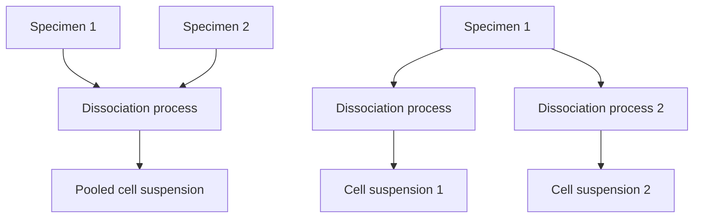
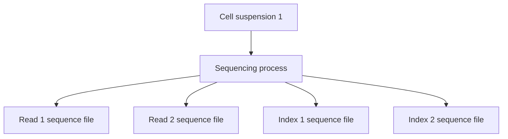

# Programmatic submissions
{: .no_toc }
## Purpose of this document
{: .no_toc }
This document is intended to give an introduction to the HCA ingest service, specifically targeting data and metadata in
the system and how they interact in the ingest ecosystem of data.

These documents will be coupled with a set of python notebooks, which will show examples of how to interact with the data.

This is the **introductory** doc, which will explain the basics behind the metadata schema and the shape/content of the
responses the user will obtain interacting with it.

## Terminology
{: .no_toc }
- HCA: Human Cell Atlas
- DCP: Data Coordination Platform
- Project: In the context of the HCA DCP Ingest Service, the term `project` may have one of 2 meanings:
    1. When referring to metadata, the JSON file that contains the metadata about a project
    2. When referring to a submission/dataset, these 3 terms can be used interchangeably to describe a set of data and metadata
       that make sense when put together (e.g. all the data from a paper and the metadata that describes it)
- Entity: In the HCA, an entity is used to describe
- Experimental graph: Representation of the experimental model and the relationships between all entities (e.g. provenance)
- Subgraph: Minimum unit an experimental graph can be broken down to while still being useful
  (e.g. All the metadata pieces needed to understand a set of fastq files)
- Ingest: Interchangeable with `Ingest Service` and `Ingest Platform`
- Ontologised: When referred to a field, that it gets validated against a specific ontology.

## Table of contents
{: .no_toc .text-delta }

1. TOC
{:toc}

## Understanding the metadata schema

The metadata schema is the staple of how data is interpreted in the system; it defines the content, validation rules and
structure of all the metadata that is in the system. For the Human Cell Atlas Data Coordination Platform, a JSON schema
was chosen to define the metadata in the system. For full details, please refer to the [metadata schema SLO](https://github.com/HumanCellAtlas/metadata-schema/blob/master/docs/metadata_slo.md)
and [rationale](https://github.com/HumanCellAtlas/metadata-schema/blob/master/docs/rationale.md) documents.

### Structure

The metadata schema is structured as stated in the [metadata entity model](https://github.com/HumanCellAtlas/metadata-schema/blob/master/docs/structure.md#metadata-entity-model)
section of the [structure.md](https://github.com/HumanCellAtlas/metadata-schema/blob/master/docs/structure.md) document of the
metadata schema repository.

For the purpose of this guide, "type entity" will be used to refer to the subtypes of the 5 major entities in the metadata model:
- Project: Contains information about the project, such as manuscript metadata, grants involved, contributors of the project etc
- File: Contains information about the data files, such as filename, description of the content, etc
- Biomaterial: Contains information about each of the biological materials used in the project, such as cell suspensions, specimens, etc.
- Protocol: Contains information about each of the protocols used on each step of the experiment.
- Process: Contains information about a process; usually, we don't need to worry a lot about processes, as they are used as intermediates in the system to create the relationships in between the other elements.

<p align="center">
  
</p>

The schemas accepted for each of the major entities can be found always under the url `https://github.com/HumanCellAtlas/metadata-schema/tree/master/json_schema/type/{major_entity}`,
substituting `{type}` with  any of the major types described previously, for example: [https://github.com/HumanCellAtlas/metadata-schema/tree/master/json_schema/type/biomaterial](https://github.com/HumanCellAtlas/metadata-schema/tree/master/json_schema/type/biomaterial)

## The HCA-DCP Ingestion Service

### What is the HCA-DCP Ingestion Service

The HCA-DCP is composed of several pieces of software that talk to each other, to ensure that the data is ingested,
stored and shared.

The HCA-DCP Ingestion service constitutes that first step, and it's on itself the `entry door` of the data to the DCP;
this is the interface that connects the users (Data scientists, data generators) with the [data portal](https://data.humancellatlas.org/).

In order to provide with that service, the Ingest Team has defined a data model, based around the entities
in the metadata schema. In this model, we have a project (See [terminology, project, meaning i](#terminology)), which
is usually associated with one or more papers and has information associated with it (see [ingest project schema](https://github.com/HumanCellAtlas/metadata-schema/tree/master/json_schema/type/project/project.json)
for more information). Within that project, you have 1 or more submissions, and each can be understood as a "data envelope"
that packs up a minimal amount of information that needs to be delivered together to e.g. the DCP data portal.

As any service, it has different environments for different purposes:
- production: [https://api.ingest.archive.data.humancellatlas.org](https://api.ingest.archive.data.humancellatlas.org)
- staging: [https://api.ingest.staging.archive.data.humancellatlas.org](https://api.ingest.staging.archive.data.humancellatlas.org)
- dev: [https://api.ingest.dev.archive.data.humancellatlas.org](https://api.ingest.dev.archive.data.humancellatlas.org)

Each one of these environments points to a different deployment of the platform, and ultimately, a good rule of thumb
is that any dataset that needs to be tested first should be brokered first through staging, since the output will not
disrupt any of the services downstream.

### What constitutes a project/submission in Ingest

In the HCA, we understand a project as the **minimum expression of data and metadata that is packed together to explain an
experimental design** and its outputs.

Below you can find an example of a whole project with a submission, and how the entities relate to each other: you can click on each of the
entities to be redirected to the folder of the metadata schema that contains all the type entities of that class.

<div class="mxgraph" style="max-width:100%;border:1px solid transparent;" data-mxgraph="{&quot;highlight&quot;:&quot;#0000ff&quot;,&quot;nav&quot;:true,&quot;resize&quot;:true,&quot;toolbar&quot;:&quot;zoom layers tags lightbox&quot;,&quot;edit&quot;:&quot;_blank&quot;,&quot;xml&quot;:&quot;&lt;mxfile host=\&quot;app.diagrams.net\&quot; modified=\&quot;2022-09-07T15:30:50.530Z\&quot; agent=\&quot;5.0 (Macintosh; Intel Mac OS X 10_15_7) AppleWebKit/537.36 (KHTML, like Gecko) Chrome/104.0.0.0 Safari/537.36\&quot; etag=\&quot;cRX-88NFg0As2ERGT6PV\&quot; version=\&quot;20.2.3\&quot; type=\&quot;google\&quot;&gt;&lt;diagram id=\&quot;Vtwi83Y6I7b7ka8JpLpU\&quot; name=\&quot;Page-1\&quot;&gt;7Vtbc5s6EP41fmwGxNWPuefhtEknc6btU0eAbJQA8gg5tvvrj8TNIGSMfXAcO00eglY3tN/ut1qJjIzreHlP4Sz8SgIUjYAWLEfGzQgA3XQA/yMkq1xiunYumFIcFI3Wgmf8BxVCrZDOcYDSRkNGSMTwrCn0SZIgnzVkkFKyaDabkKg56wxOUUvw7MOoLf2BAxbmUhc4a/kDwtOwnFm3x3lNDMvGxUrSEAZkURMZtyPjmhLC8qd4eY0iobxSL3m/uw211YtRlDBFh39TRB+9F6EToEXQ47hkjfJuEU5e83LImFDlpegI7qaYhXPvwicxLzzMY5iIaS9ZBFMuiBGDAWTwS+qHKIZcwihCogKmDFH+8JKS5Pe6djUTtTNK8vcAtff/MbG8X7cv9+b9w3f69idaTLD5xaj0Uq03ZasSC0rmSYBEf21kXC1CzNDzDPqidsGtj8tCFotl6vxxgqPomkSEZn2NyWQCfJ/LU0bJK6rVBLZnWzavyd/vDVGGlht1rNfe8B4RrhG64k2KDm6BdWnsRXGxthynNIewZjWmVghhYa3TauQ1oELNuVLKYg1itY0odWwW64TRvNDrUx2fmr65HlhTqU3lJSRBkqYLEYzwNOFFn+uN24VxJbSKuVddFhUxDgIxjRLFJs4DwGLqW3GxFbAYu6PSDwK7BUFL95wtZuIxIP48zpa5zeC9XGv/eJs8wBK/Qk4SVpPnPyrPsLOfYSAYNxHQNYVraAoMqkAwOAhOC4TnuRfjNMUkuU3eUEQEeZ2rSxgSVel6GxBdxVV7OMWmUHSFCY+SiGIYHSEqefLsndbidkYmLuAbEgFe6bd+RObBzlEqsJAbmCpfdIFnDOWLlfOV2Ns9sXcHCVObzIGHIR+l6XE2KOuZO81g3NMMdoMd6Rx4RwX72HYMOBDswJJgd/uFQfMdNye6vj00oiS4FDv7zMsg52u/qdwmV6IlZj/F84XrWEX5V1YuSzfLWtObVa3wxNmBL1XQdS5L+LJ/1gu1kURxPVRWKsfKl4CCVqohQceXSebURz15qAZxDUJLAWEpoyiCDL81X0OFazHDE8EJqwUNKYq3CCF//aJXPXmRBpJNEcgbYAbpFLHWQJmZVcveP/broGVm3zjFfD3feA9kzncOtgfu4HdGfHKMWD9rTN1tGt05aBnfQ7SEU8JxvJrVSKKQVrwB+oSCJSrPPZR5K7I35K3O2NOGsg4TcBLbth90rEHsY//g0E5dBwsO9dCgdwaGAcm8YWsnzOZyLiEPdGg2tz4dm8saV5xoqCznkyZvut3J6aeVvRkWaGJv2S3sD5i99XTJ9unKQFStj/rv4ftS9dEYWN+yDe7LwIZz5P20+9kYWIZOtZ8eiIF7QjDeyeMKrQYwDTO16E1UhPwJMq7pJJMAbX1CXN6DgbaPVvlxmWz3z5Gzkpxwf3QHtuQt1L4ObNrmXg7M4YSrWrOZaJDu5uKbIvwdjtARQvukmrbT3mt3qF15WkJYj/M4D/qv08yWH+eMrxZVbkBfH3kvzDIzvdAsRdSHyJ0oMzTbd5E3GYZvHJlvrDbfuApD14e5WjzlM9ucCE/00NaWz20+4KEtMD7CZm/fw9n/FXh6JPmlMnIG78top3saYJrSQPKW58B7UdA+JdLPey9qyxc7x96Lgr8fOBigjYHyAwf9YB84gL9fODQQMdqIDPWFQ09A2llyV5w8SIrWN7AdKwxViJSolZcOu4Yhx94y0N5h6LTvt0D3Jwzneb9ljY1mhPyAt1vlXGdzu9WwtHcnEsfUpCvNvXe0tiEP9d43XEb7s5gzP19V6Pxwd1y8uP4OP8ds/d8Mxu1/&lt;/diagram&gt;&lt;/mxfile&gt;&quot;}"></div>
<script type="text/javascript" src="https://viewer.diagrams.net/js/viewer-static.min.js"></script>

Most of the relationships allowed by the system are `M:N`; what this means, is that given the following:
- Biomaterial/file
- Process

All of the following scenarios are possible




A couple of general rules on how experiments are modeled in the HCA:
- The input of a process can be one/several biomaterial/files
- The output of a process will be either one biomaterial or one/several files
- A process is unique and cannot be used multiple times.
- (Not shown in figure) A process can have as many protocols attached as needed
- Protocols are attached independently of inputs/outputs

Please take into account that there are exceptions; these rules apply to our modelling decisions rather than to limitations
of our system, so if you feel that these rules do not apply to your experiment, please contact us at [the wrangler email](mailto:wrangler-team@data.humancellatlas.org).

### How to interact with Ingest: the API

As any service that stores and surfaces data, the HCA DCP Ingestion service has several ways of floating the metadata.
In these guidelines, I will mainly focus on the API, as it will be the only way that the notebook will teach to interact
with ingest.

The Ingest API is a RESTful API that is formatted in the JSON Hypertext Application Language (HAL), which makes it so that
the content returned by the API can be consistently accessed. You can find more information on the consistent fields
in the [API specification](#extra-information) section.

## Understanding the JSON files in the system

Metadata files in the system are stored as JSON entries; more concretely, they are stored as entries in a MongoDB database and
exposed through the API. In these guidelines, it will be shown how to use the Ingest client to interact with the API;
the client just provides an easy-to-use CLI interface to interact.

The next documents will deal with each `entity type` individually, so what you could expect here is a general understanding
that may apply to all the entities, e.g. the specific HAL-related fields that populate the API responses.

### Metadata validation

The Ingest Service validates the metadata that comes into the system by using the [ingest-validator](https://github.com/ebi-ait/ingest-validator).
The platform does all the work for the user, so you don't need to worry about triggering anything.

#### Ontologised fields

One of the main reasons why Ingest uses a custom JSON schema validation is that many fields are `ontologised`. In a
JSON file, you can recognise an ontologised term because it always presents the next fields:
- `text`: Free text, for the user to input what's closest to what they are trying to describe (e.g. `Disease status`)
- `ontology`: An identifier, in the form of PREFIX:ACCESSION (e.g. PATO:000461). This is the field that will be validated against the ontology.
- `ontology_label`: The label that is officially assigned to that ontology term.

An example for disease status:

```json
{
  "text": {
    "description": "The text for the term as the user provides it.",
    "type": "string",
    "user_friendly": "Disease",
    "example": "type 2 diabetes mellitus; normal"
  },
  "ontology": {
    "description": "An ontology term identifier in the form prefix:accession.",
    "type": "string",
    "graph_restriction": {
      "ontologies": [
        "obo:mondo",
        "obo:efo",
        "obo:hp"
      ],
      "classes": [
        "MONDO:0000001",
        "PATO:0000461",
        "HP:0000118"
      ],
      "relations": [
        "rdfs:subClassOf"
      ],
      "direct": false,
      "include_self": true
    },
    "user_friendly": "Disease ontology ID",
    "example": "MONDO:0005148; PATO:0000461; HP:0001397"
  },
  "ontology_label": {
    "description": "The preferred label for the ontology term referred to in the ontology field. This may differ from the user-supplied value in the text field.",
    "type": "string",
    "user_friendly": "Disease ontology label",
    "example": "type 2 diabetes mellitus; normal"
  }
}
```

A couple of key notes about ontologised fields:
- The validator will always look up for terms that are within the [**HCAO Ontology**](https://ontology.archive.data.humancellatlas.org/index).
- The `relations` field defines which relationships are accepted under the class (e.g. must be subclass of `disease`)
- The schemas to look up for the ontology restrictions can be found under the [module/ontology](https://github.com/HumanCellAtlas/metadata-schema/tree/master/json_schema/module/ontology)
  folder in the HCA Metadata Schema repository.

#### Other type of fields

As with any JSON schema, fields can contain many types of values; to find a description of the types of values accepted,
please refer to the [type-specific keywords](https://json-schema.org/understanding-json-schema/reference/type.html)
documentation in the official JSON Schema webpage.

### API specification

As a general rule (Except for the project metadata), the user should only worry about the `content` field, which is
the part of the response that will contain the submitted metadata, and the CLI works as an interface so there's no
need to know the rest of the fields.

However, in this section, there will be a brief explanation on what fields you will find if you were to inspect the
responses.

#### content

This is the metadata that the user has submitted for that specific entity; for a more in-depth explanation, please refer
to the specific documents about the 5 types of entities.

#### _links

The content of this field contains all the URIs needed to navigate and interact with the API.
These links contain a reference to an endpoint that is related to this entity, which can be used to refer to
`relationships` (e.g. inputToProcesses, self, project, biomaterials, etc) or be used as the URI for a POST/PATCH/PUT
request to modify the entity or its relationships.

The specific fields will not be detailed here, as they are slightly different for each entity, but there will be an
in-depth explanation on the guidelines section about linking entities together.

As a note, all the links are expressed under an `href` field, which signifies that is a hyperlink. For example:
```json
{
  "_links":
  {
    "self": {
      "href": "url_to_self"
    }
  }
}
```

#### System-specific fields

These fields will be available if you inspect the response of any object in the system: you do not need to worry about them,
as Ingest will fill them automatically. For the sake of clarity, here is a brief description for them.

- `submissionDate`:  Date of submission of the JSON file. This is the date the entity was first created in the system
- `updateDate`: Last time the JSON file was updated
- `user`: ID of the user who created this entity.
- `lastModifiedUser`: ID of the user who last modified this entity
- `type`: Type of entity, must be one of the 5 specified in the [structure](#structure) section
- `uuid`: Universally Unique IDentifier for the entity; assigned at creation
- `events`: <span style="color:red">**_OUTDATED_**</span> Recording of events that the entity have gone through.
- `firstDcpVersion`: First date that the document was created
- `dcpVersion`: Last time the JSON file was updated; same as `updateDate`
- `contentLastModified`: Last time the METADATA (content) was updated
- `accession`: Accession(s) that is/are associated with this entity
- `validationState`: Validation state of the entity; May be `draft`, `metadata valid`, `metadata invalid`
- `validationErrors`: Collection of validationErrors, associated with the JSON schema validation
- `graphValidationErrors`: Collection of validationErrors, associated with the Ingest graph validator (Covered in a later section)
- `isUpdate`: <span style="color:red">**_OUTDATED_**</span> If this entity is an update. This was used when duplicates were used to update the entities in the system.
- `linked`: If the entity is linked in the system with other entities (e.g. a Biomaterial to a process).


#### More information

If you are interested in learning more about the API endpoints and the metadata that each presents, you can go to the
root of the API (Stated [here](#what-is-the-hca-dcp-ingestion-service)) and travel the endpoints. Please be advised that
for most of the endpoints, you will need to retrieve a token. More information on how to obtain a token
[here](https://ebi-ait.github.io/hca-ebi-dev-team/operations_tasks/api_token.html).

## Before you start the practical part

The next steps are only needed if you plan to work with code outside of the Google Colab Notebooks:
- Create a virtual environment and activate it
- Install hca-ingest: `pip3 install hca-ingest`
